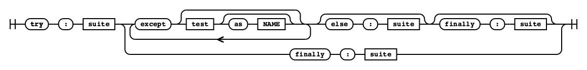

## 파이썬 언어와 문법

### 4.1 CPython이 파이썬이 아니라 C로 작성된 이유

#### 컴파일러의 유형

##### - **셀프 호스팅 컴파일러** : 자기 자신의 언어로 작성된 컴파일러 ex) GO

##### - **Source to source 컴파일러** : 컴파일러를 이미 가지고 있는 다른 언어로 작성한 컴파일러

<br><br>

##### CPython은 많은 표준 라이브러리 모듈이 C로 작성되었기 때문에 C를 계속 사용하고 있다.

***

### 4.2 파이썬 언어 사양

#### 4.2.1 파이썬 언어 레퍼런스

https://github.com/python/cpython/tree/main/Doc/reference

해당 레포에서 파이썬 언어 레퍼런스 문서를 확인 할 수 있다.

<br>

#### 4.2.2 문법 파일

##### 파이썬의 문법 파일은 파서 표현식 문법(parsing expression grammar, PEG) 사양을 사용한다.

##### 배커스-나우르 표기법(Backus-NaurForm, BNF)은 3.10에서 삭제되었다.

##### try에 대한 철도 다이어그램(railroad diagram)

```
try_stmt[stmt_ty]:
    | invalid_try_stmt
    | 'try' &&':' b=block f=finally_block { _PyAST_Try(b, NULL, NULL, f, EXTRA) }
    | 'try' &&':' b=block ex[asdl_excepthandler_seq*]=except_block+ el=[else_block] f=[finally_block] { _PyAST_Try(b, ex, el, f, EXTRA) }
    | 'try' &&':' b=block ex[asdl_excepthandler_seq*]=except_star_block+ el=[else_block] f=[finally_block] {
        CHECK_VERSION(stmt_ty, 11, "Exception groups are",
                      _PyAST_TryStar(b, ex, el, f, EXTRA)) }
```



***

### 4.3 파서 생성기

##### 파이썬 컴파일러는 문법 파일을 직접 사용하지 않고 파서 생성기가 문법 파일에서 생성한 파서를 사용한다.

##### 파이썬 3.9 부터 CPython은 파서 테이블 생성기(pgen 모듈) 대신 문맥 의존 문법 파서를 사용한다.

***

### 4.4 문법 다시 생성하기 

