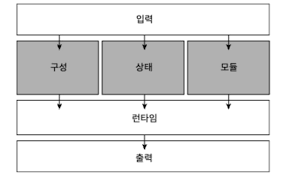

## 구성과 입력

##### 1. python -c : 파이썬 문자열 실행하기
##### 2. python -m : 모듈 실행하기
##### 3. python <file> : 파이썬 코드가 들어있는 파일 실행하기
##### 4. cat <file> | python : 파이썬 코드를 stdin으로 python에 파이프 하기
##### 5. REPL에서 한 번에 하나씩 명령 실행하기
##### 6. C API를 사용해 파이썬을 임베디드 환경으로 사용하기

<br>

##### 인터프리터가 파이썬 코드를 실행하려면 세 가지 요소가 필요하다.
##### - 실행할 모듈
##### - 변수 등을 저장할 상태
##### - 활성화된 옵션 등의 구성



### 5.1 구성 상태

##### 파이썬 코드를 실행하기 전에 CPython 런타임은 먼저 사용자 옵션과 구성을 설정한다.

##### CPython 구성
##### - PyPreConfig 딕셔너리 초기화 구성
##### - PyConfig 런타임 구성
##### - CPython 인터프리터에 같이 컴파일된 구성

#### 5.1.1. 딕셔너리 초기화 구성

##### 딕셔너리 초기화 구성은 사용자 환경 또는 운영 체제와 관련된 구성이기 때문에 런타임 구성과 구분된다.

##### PyPreConfig의 세 가지 주요 기능
##### - 파이썬 메모리 할당자 설정하기
##### - LC_CTYPE 로캘(locale)을 시스템 또는 사용자 선호 로캘로 구성하기
##### - UTF-8 모드 설정하기 (PEP 540)

**config_init**

##### 초기화 방법을 설정합니다. PyConfig_INIT_COMPAT, PyConfig_INIT_PYTHON, PyConfig_INIT_ISOLATED 등의 상수를 통해 초기화 방법을 지정할 수 있습니다.


**isolated**

##### Python을 고립된 상태로 실행할지 여부를 설정합니다. 1로 설정하면 PYTHON* 환경 변수를 무시하고, site 패키지를 로드하지 않습니다.

**use_environment**

##### Python 초기화 시 환경 변수의 사용 여부를 설정합니다. 1로 설정하면 환경 변수(PYTHONPATH, PYTHONHOME 등)를 사용하고, 0으로 설정하면 무시합니다.


**utf8_mode**

##### Python의 UTF-8 모드를 설정합니다. 1로 설정하면 UTF-8 모드를 강제로 활성화하며, 0으로 설정하면 비활성화합니다.


**allocator**

##### 메모리 할당기를 설정합니다. PYMEM_ALLOCATOR_NOT_SET, PYMEM_ALLOCATOR_MALLOC, PYMEM_ALLOCATOR_DEBUG 등의 옵션을 통해 특정 메모리 할당기 유형을 지정할 수 있습니다.


**configure_locale**

##### 로케일을 자동으로 설정할지 여부를 설정합니다. 기본값은 1이며, Python이 시작할 때 자동으로 로케일을 설정합니다.


**coerce_c_locale**

##### C 로케일을 강제로 사용하도록 할지 여부를 설정합니다. 기본값은 0이며, 설정하면 C 로케일을 사용하도록 강제할 수 있습니다.


**coerce_c_locale_warn**

##### C 로케일 강제 사용 시 경고 메시지를 표시할지 여부를 설정합니다. 기본값은 0이며, 경고를 표시하지 않습니다. 1로 설정하면 경고가 활성화됩니다.

#### 5.1.2 연관된 소스 파일 목록

##### Python/initconfig.c : 시스템 환경에서 불러온 구성을 명령줄 플래그와 결합한다.
##### Include/cpython/initconfig.h : 초기화 구성 구조체를 정의한다.

#### 5.1.3 런타임 구성 구조체

##### 딕셔너리 초기화 구성 다음 단계는 런타임 구성 단계다.

**buffered_stdio**

##### 0과 같으면, 버퍼링 되지 않는 모드를 활성화하여, stdout과 stderr 스트림을 버퍼링하지 않도록 합니다. stdin은 항상 버퍼링 모드로 열립니다.

**bytes_warning**

##### 1과 같으면, bytes나 bytearray를 str와 비교하거나, 또는 bytes를 int와 비교할 때 경고를 발행합니다. 2 이상이면, BytesWarning 예외를 발생시킵니다.

**configure_c_stdio**

##### 0이 아니면, C 표준 스트림(stdio, stdout, stdout)을 구성합니다. 예를 들어, 윈도우에서 해당 모드를 O_BINARY로 설정합니다.

**dev_mode**

##### 개발 모드: -X dev를 참조하십시오.

**dump_refs**

##### 0이 아니면, 종료 시 여전히 활성 상태인 모든 객체를 덤프합니다.파이썬의 디버그 빌드가 필요합니다 (Py_REF_DEBUG 매크로를 정의해야 합니다).

#### 5.1.4 명령줄로 런타임 구성 설정하기

##### verbose로 hello world를 찍어 본다.

```
(base) sondonghyeob@sondonghyeobs-MacBook-Air cpython % ./python.exe -v -c "print('hello world')"
import _frozen_importlib # frozen
import _imp # builtin
import '_thread' # <class '_frozen_importlib.BuiltinImporter'>
import '_warnings' # <class '_frozen_importlib.BuiltinImporter'>
import '_weakref' # <class '_frozen_importlib.BuiltinImporter'>
import '_io' # <class '_frozen_importlib.BuiltinImporter'>
import 'marshal' # <class '_frozen_importlib.BuiltinImporter'>
import 'posix' # <class '_frozen_importlib.BuiltinImporter'>
import '_frozen_importlib_external' # <class '_frozen_importlib.FrozenImporter'>
# installing zipimport hook
import 'time' # <class '_frozen_importlib.BuiltinImporter'>
import 'zipimport' # <class '_frozen_importlib.FrozenImporter'>
# installed zipimport hook
# /Users/sondonghyeob/project/cpython/Lib/encodings/__pycache__/__init__.cpython-314.pyc matches /Users/sondonghyeob/project/cpython/Lib/encodings/__init__.py
# code object from '/Users/sondonghyeob/project/cpython/Lib/encodings/__pycache__/__init__.cpython-314.pyc'
import '_codecs' # <class '_frozen_importlib.BuiltinImporter'>
import 'codecs' # <class '_frozen_importlib.FrozenImporter'>
# /Users/sondonghyeob/project/cpython/Lib/encodings/__pycache__/aliases.cpython-314.pyc matches /Users/sondonghyeob/project/cpython/Lib/encodings/aliases.py
# code object from '/Users/sondonghyeob/project/cpython/Lib/encodings/__pycache__/aliases.cpython-314.pyc'
import 'encodings.aliases' # <_frozen_importlib_external.SourceFileLoader object at 0x1054d4cd0>
import 'encodings' # <_frozen_importlib_external.SourceFileLoader object at 0x10546d940>
# /Users/sondonghyeob/project/cpython/Lib/encodings/__pycache__/utf_8.cpython-314.pyc matches /Users/sondonghyeob/project/cpython/Lib/encodings/utf_8.py
# code object from '/Users/sondonghyeob/project/cpython/Lib/encodings/__pycache__/utf_8.cpython-314.pyc'
import 'encodings.utf_8' # <_frozen_importlib_external.SourceFileLoader object at 0x1054d5d10>
import '_signal' # <class '_frozen_importlib.BuiltinImporter'>
import '_abc' # <class '_frozen_importlib.BuiltinImporter'>
import 'abc' # <class '_frozen_importlib.FrozenImporter'>
import 'io' # <class '_frozen_importlib.FrozenImporter'>
import '_stat' # <class '_frozen_importlib.BuiltinImporter'>
import 'stat' # <class '_frozen_importlib.FrozenImporter'>
import '_collections_abc' # <class '_frozen_importlib.FrozenImporter'>
import 'errno' # <class '_frozen_importlib.BuiltinImporter'>
import 'genericpath' # <class '_frozen_importlib.FrozenImporter'>
import 'posixpath' # <class '_frozen_importlib.FrozenImporter'>
import 'os' # <class '_frozen_importlib.FrozenImporter'>
import '_sitebuiltins' # <class '_frozen_importlib.FrozenImporter'>
Processing user site-packages
Processing global site-packages
import 'site' # <class '_frozen_importlib.FrozenImporter'>
Python 3.14.0a1+ (heads/main-dirty:9fc2808eaf4, Nov 11 2024, 23:07:42) [Clang 14.0.3 (clang-1403.0.22.14.1)] on darwin
Type "help", "copyright", "credits" or "license" for more information.
# /Users/sondonghyeob/project/cpython/Lib/__pycache__/linecache.cpython-314.pyc matches /Users/sondonghyeob/project/cpython/Lib/linecache.py
# code object from '/Users/sondonghyeob/project/cpython/Lib/__pycache__/linecache.cpython-314.pyc'
import 'linecache' # <_frozen_importlib_external.SourceFileLoader object at 0x1054ea060>
hello world
# clear sys.path_importer_cache
# clear sys.path_hooks
# clear builtins._
# clear sys.path
# clear sys.argv
# clear sys.ps1
# clear sys.ps2
# clear sys.last_exc
# clear sys.last_type
# clear sys.last_value
# clear sys.last_traceback
# clear sys.__interactivehook__
# clear sys.meta_path
# restore sys.stdin
# restore sys.stdout
# restore sys.stderr
# cleanup[2] removing sys
# cleanup[2] removing builtins
# cleanup[2] removing _frozen_importlib
# cleanup[2] removing _imp
# cleanup[2] removing _thread
# cleanup[2] removing _warnings
# cleanup[2] removing _weakref
# cleanup[2] removing _io
# cleanup[2] removing marshal
# cleanup[2] removing posix
# cleanup[2] removing _frozen_importlib_external
# cleanup[2] removing time
# cleanup[2] removing zipimport
# destroy zipimport
# cleanup[2] removing _codecs
# cleanup[2] removing codecs
# cleanup[2] removing encodings.aliases
# cleanup[2] removing encodings
# destroy encodings
# cleanup[2] removing encodings.utf_8
# cleanup[2] removing _signal
# cleanup[2] removing _abc
# cleanup[2] removing abc
# cleanup[2] removing io
# cleanup[2] removing __main__
# destroy __main__
# cleanup[2] removing _stat
# cleanup[2] removing stat
# cleanup[2] removing _collections_abc
# destroy _collections_abc
# cleanup[2] removing errno
# cleanup[2] removing genericpath
# cleanup[2] removing posixpath
# cleanup[2] removing os.path
# cleanup[2] removing os
# cleanup[2] removing _sitebuiltins
# cleanup[2] removing site
# destroy site
# cleanup[2] removing linecache
# destroy linecache
# destroy _signal
# destroy _stat
# destroy _abc
# destroy _sitebuiltins
# destroy io
# destroy abc
# destroy posixpath
# destroy errno
# destroy genericpath
# destroy os
# destroy stat
# destroy time
# cleanup[3] wiping encodings.utf_8
# cleanup[3] wiping encodings.aliases
# cleanup[3] wiping codecs
# cleanup[3] wiping _codecs
# cleanup[3] wiping _frozen_importlib_external
# cleanup[3] wiping posix
# cleanup[3] wiping marshal
# destroy marshal
# cleanup[3] wiping _io
# cleanup[3] wiping _weakref
# cleanup[3] wiping _warnings
# cleanup[3] wiping _thread
# cleanup[3] wiping _imp
# cleanup[3] wiping _frozen_importlib
# destroy _warnings
# destroy _weakref
# destroy _frozen_importlib_external
# destroy _imp
# cleanup[3] wiping sys
# cleanup[3] wiping builtins
# destroy sys.monitoring
# destroy _thread
# destroy _io
# destroy posix
# clear sys.meta_path
# clear sys.modules
# destroy _frozen_importlib
# destroy codecs
# destroy sys
# destroy encodings.aliases
# destroy encodings.utf_8
# destroy builtins
# destroy _codecs
# clear sys.audit hooks
```

##### 상세모드(verbose)설정에 대한 우선순위

##### 1. config->verbose의 기본값은 -1로 소스코드에 하드코딩
##### 2. PYTHONVERBOSE 환경 변수를 config->verbose를 설정하는데 사용한다.
##### 3. 환경 변수가 없으면 기본값인 -1을 사용한다.
##### 4. Python/initconfig.c의 config_parse_cmdline()은 명시된 명령줄 플래그를 사용해 모드를 설정한다.
##### 5. _Py_GetGlobalVariablesAsDict()가 값을 전역 변수 Py_VerboseFlag로 복사한다.


#### 5.1.5 런타임 플래그 확인하기

##### CPython 인터프리터의 런타임 플래그는 CPyhon의 동작들을 끄고 켜는 데 사용하는 고급 기능이다.

```
>>> import sys
>>> sys.flags
sys.flags(debug=0, inspect=0, interactive=0, optimize=0, dont_write_bytecode=0, no_user_site=0, no_site=0, ignore_environment=0, verbose=0, bytes_warning=0, quiet=1, hash_randomization=1, isolated=0, dev_mode=True, utf8_mode=0, warn_default_encoding=0, safe_path=False, int_max_str_digits=4300)
>>> sys._xoptions
{'dev': True}
>>> 
```

##### -X 플래그는 다양한 실행 옵션을 제어할 수 있는 명령줄 인수 입니다. 특정 기능을 활성화하거나 비활성화 하는데 사용됩니다.
##### 디버깅이나 성능 최적화, 실험적인 그닝을 제어하는데 사용합니다.

***

### 5.2 빌드 구성

##### 빌드 구성은 pyconfig.h에서 정의한다.
##### ./configure나 build.bat 실행중에 자동으로 생성된다.

```
$./python.exe -m sysconfig
```

##### 위의 명령어로 빌드 구성을 확인할 수 있다.
##### 세단계의 구성을 모두 완료하면 CPythjon 인터프리터는 입력된 텍스트를 코드로 실행할 수 있다.

***

### 5.3 입력에서 모듈 만들기

##### 코드를 실행하려면 먼저 입력을 모듈로 컴파일해야 한다. 다음과 같이 입력방식에는 여러가지가 있다.

##### - 로컬 파일과 패키지
##### - 메모리 파이프나 stdin 같은 I/O 스트림
##### - 문자열


##### 3가지의 입력 방식을 제공하기 위해 CPython 소스 코드의 상당 부분은 파서의 입력 처리에 사용 됩니다.

#### 5.3.1 연관된 소스 파일 목록

##### Lib/runpy.py : 파이썬 모듈을 임포트하고 실행하는 표준 라이브러리 모듈
##### Modules/main.c : 파일이나 모듈, 입력 스트림 같은 외부 코드 실행을 감싸는 함수
##### Programs/python.c : 윈도우나 리눅스, macOS에서 python의 진입점, Modules/main.c를 감싸는 역할만 맡는다.
##### Python/Pythonrun.c : 명령줄 입력을 처리하는 내부 C API를 감싸는 함수

#### 5.3.2 입력과 파일 읽기

##### CPython은 런타임 구성과 명령줄 인자가 준비되면 실행할 코드를 불러온다. 이 작업은 Modules/main.c의 pymain_main()이 실행한다. 이후 불러온 코드를 새로 생성된 PyConfig 인스턴스에 설정된 옵션들과 함께 실행한다.

#### 5.3.3 명령줄 문자열 입력

##### CPython은 -c 옵션을 사용해 명령줄에서 작은 파이썬 애플리케이션을 실행 할 수 있다.

```
(base) sondonghyeob@sondonghyeobs-MacBook-Air cpython % ./python.exe -c "print(2 ** 7)"
128
```

##### pymain_run_command()는 파이썬 바이트열 객체를 PyRun_SimpleStringFlags로 넘겨서 실행
##### Python/pythonrun.c의 PyRun_SimpleStringFlags()는 문자열을 파이썬 모듈로 변환하고 실행한다.
##### 파이썬 모듈을 독립된 모듈로 실행하려면 __main__ 진입점이 필요하기 때문에 PyRun_SimpleStringFlags()가 진입점을 자동으로 추가한다.
##### PyRun_SimpleStringFlags()는 딕셔너리와 모듈을 만든 후 PyRun_StrinFlags()를 호출한다. 
##### PyRun_StrinFlags()는 가짜 파일 이름을 만들고 파이썬 파서를 실행해서, 문자열에서 추상 구문 트리를 생성해 모듈로 반환한다.

#### 5.3.4 로컬 모듈 입력

##### 파이썬의 -m 옵션과 모듈 이름으로 파이썬 명령을 실행할 수도 있다.

```
$ ./python -m unittest
or
$ ./python -m runpy unittest
```

##### -m 플래그는 모듈 패키지의 진입점(__main__)을 실행한다.
##### CPython은 표준 라이브러리 모듈 runpy를 임포트하고 PyObject_call()로 해당 모듈을 실행한다.

##### runpy는 세 단계롤 모듈을 실행한다.

##### 1. 제공된 모듈 이름을 __import__()로 임포트 한다.
##### 2. __name__(모듚 이름)을 __main__ 이름 공간에 설정한다.
##### 3. __main__ 이름 공간에서 모듈을 실행한다.

##### runpy는 디렉토리와 zip파일 실행도 지원한다.

#### 5.3.5 표준 입력 또는 스크립트 파일 입력

##### PyRun_SimpleFileExFlags() 함수는 

##### 1. .pyc 파일 경로면 run_pyc_file()을 호출한다.
##### 2. .py 파일 경로면 PyRun_FileExFlags()를 호출한다.
##### 3. <command> | python 처럼 파일 경로가 stdin 이면 stdin을 파일 핸들로 취급하고 PyRun_FileExFlags()를 호출한다.

#### 5.3.6 컴파일된 바이트코드 입력

##### python을 .pyc 파일 경로와 함께 실행하면 파싱하는 대신에 .pyc파일에서 디스크에 기록된 코드 객체를 찾아 처리한다.