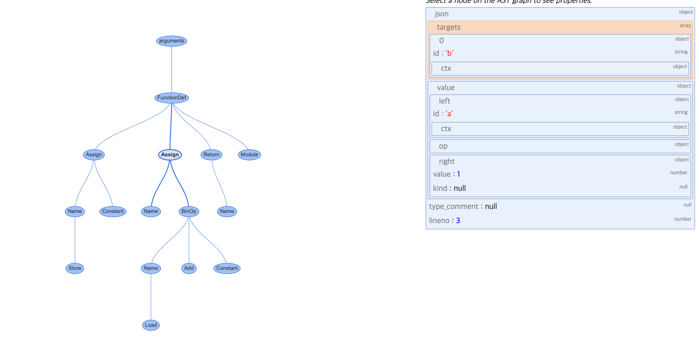

## 렉싱과 파싱

##### 파이썬 코드는 파싱단계를 거쳐 컴파일러에서 사용할 수 있는 구조(컴파일 가능한 논리적 구조)로 변환된다.
##### 


<출처 : https://gobae.tistory.com/94>

##### Cpython은 코드를 파싱하기 위해 **CST**(concrete syntax tree)와 **AST**(abstract snytax tree) 두가지 구조를 사용한다.

##### 파서-토크나이저 또는 렉서가 CST를 생성한다.
##### 파서가 CST로부터 AST를 생성한다.

***

### 6.1 CST 생성

##### CST(파스트리)는 문맥 자유 문법에서 코드를 표현하는 루트와 순서가 있는 트리이다.
##### 소스트리가 문법에 맞는지 확인하는데 사용된다.


<출처 : https://pseudo-lab.github.io/CPython-Guide/docs/6_0_rexing_and_parsing.html>

##### CST를 구성하는 모든 심벌은 Grammar에서 정의한다.

```
ENDMARKER
NAME
NUMBER
STRING
NEWLINE
INDENT
DEDENT

LPAR                    '('
RPAR                    ')'
LSQB                    '['
RSQB                    ']'
COLON                   ':'
COMMA                   ','
SEMI                    ';'
PLUS                    '+'
MINUS                   '-'
STAR                    '*'
SLASH                   '/'
VBAR                    '|'
AMPER                   '&'
LESS                    '<'
GREATER                 '>'
EQUAL                   '='
DOT                     '.'
PERCENT                 '%'
LBRACE                  '{'
RBRACE                  '}'
EQEQUAL                 '=='
```

##### 파이썬에서 symbol과 token모듈로 컴파일된 심볼과 토큰을 확인 할 수 있습니다.
```
>>> dir(symbol)
['__builtins__', '__cached__', '__doc__', '__file__', '__loader__', '__name__', '__package__', '__spec__', 'and_expr', 'and_test', 'annassign', 'arglist', 'argument', 'arith_expr', 'assert_stmt', 'async_funcdef', 'async_stmt', 'atom', 'atom_expr', 'augassign', 'break_stmt', 'classdef', 'comp_for', 'comp_if', 'comp_iter', 'comp_op', 'comparison', 'compound_stmt', 'continue_stmt', 'decorated', 'decorator', 'decorators', 'del_stmt', 'dictorsetmaker', 'dotted_as_name', 'dotted_as_names', 'dotted_name', 'encoding_decl', 'eval_input', 'except_clause', 'expr', 'expr_stmt', 'exprlist', 'factor', 'file_input', 'flow_stmt', 'for_stmt', 'func_body_suite', 'func_type', 'func_type_input', 'funcdef', 'global_stmt', 'if_stmt', 'import_as_name', 'import_as_names', 'import_from', 'import_name', 'import_stmt', 'lambdef', 'lambdef_nocond', 'namedexpr_test', 'nonlocal_stmt', 'not_test', 'or_test', 'parameters', 'pass_stmt', 'power', 'raise_stmt', 'return_stmt', 'shift_expr', 'simple_stmt', 'single_input', 'sliceop', 'small_stmt', 'star_expr', 'stmt', 'subscript', 'subscriptlist', 'suite', 'sym_name', 'sync_comp_for', 'term', 'test', 'test_nocond', 'testlist', 'testlist_comp', 'testlist_star_expr', 'tfpdef', 'trailer', 'try_stmt', 'typedargslist', 'typelist', 'varargslist', 'vfpdef', 'warnings', 'while_stmt', 'with_item', 'with_stmt', 'xor_expr', 'yield_arg', 'yield_expr', 'yield_stmt']
>>> 
```

```
>>> dir(token)
['AMPER', 'AMPEREQUAL', 'ASYNC', 'AT', 'ATEQUAL', 'AWAIT', 'CIRCUMFLEX', 'CIRCUMFLEXEQUAL', 'COLON', 'COLONEQUAL', 'COMMA', 'COMMENT', 'DEDENT', 'DOT', 'DOUBLESLASH', 'DOUBLESLASHEQUAL', 'DOUBLESTAR', 'DOUBLESTAREQUAL', 'ELLIPSIS', 'ENCODING', 'ENDMARKER', 'EQEQUAL', 'EQUAL', 'ERRORTOKEN', 'EXACT_TOKEN_TYPES', 'GREATER', 'GREATEREQUAL', 'INDENT', 'ISEOF', 'ISNONTERMINAL', 'ISTERMINAL', 'LBRACE', 'LEFTSHIFT', 'LEFTSHIFTEQUAL', 'LESS', 'LESSEQUAL', 'LPAR', 'LSQB', 'MINEQUAL', 'MINUS', 'NAME', 'NEWLINE', 'NL', 'NOTEQUAL', 'NT_OFFSET', 'NUMBER', 'N_TOKENS', 'OP', 'PERCENT', 'PERCENTEQUAL', 'PLUS', 'PLUSEQUAL', 'RARROW', 'RBRACE', 'RIGHTSHIFT', 'RIGHTSHIFTEQUAL', 'RPAR', 'RSQB', 'SEMI', 'SLASH', 'SLASHEQUAL', 'STAR', 'STAREQUAL', 'STRING', 'TILDE', 'TYPE_COMMENT', 'TYPE_IGNORE', 'VBAR', 'VBAREQUAL', '__all__', '__builtins__', '__cached__', '__doc__', '__file__', '__loader__', '__name__', '__package__', '__spec__', 'tok_name']
>>> 
```

***

### 6.2 파서-토크나이저

##### 렉서 구현은 프로그래밍 언어마다 다릅니다. 렉서 생성기로 파서 생성기를 보완하는 언어도 있다.

#### 6.2.1 연관된 소스 파일 목록

##### Python/pythonrun.c : 파서와 컴파일러 실행
##### Parser/parsetok.c : 파서와 토크나이저 구현
##### Parser/tokenizer.c : 토크나이저 구현
##### Parser/tokenizer.h : 토큰 상태 등의 데이터 모델을 정의하는 토크나이저 구현 헤더 파일
##### Include/token.h : Tools/scripts/generate_token.py에 의해 생성되는 토큰 정의
##### Include/node.h : 토크나이저를 위한 CST 노드 인터페이스와 매크로

#### 6.2.2 파일 데이터를 파서에 입력하기

##### 파서-토크나이저의 진입점인 PyParser_ASTFromFileObject()는 파일 핸들과 컴파일러 플래그, PyArena 인스턴스를 받아 파일 객체를 모듈로 변환한다. 

##### 1. PyParser_ParseFileObject()를 사용해 token_state를 초기화 하며 CST로 변환
##### 2. PyAST_FronNodeObject()를 사용해 CST를 AST또는 모듈로 변환

#### 6.2.3 파서-토크나이저의 흐름

##### 


<https://pseudo-lab.github.io/CPython-Guide/docs/6_0_rexing_and_parsing.html>

##### 1. 파서-토크나이저는 커서가 텍스트 입력의 끝에 도달하거나 문법 오류가 발견 될 때까지 파서와 토크나이저를 실행한다.

```
#endif

    for (;;) {
        const char *a, *b;
        int type;
        size_t len;
        char *str;
        col_offset = -1;
        int lineno;
        const char *line_start;

        type = PyTokenizer_Get(tok, &a, &b);
        ...
```

##### 2. tok_state를 초기화 합니다.

```
node *
PyParser_ParseFileObject(FILE *fp, PyObject *filename,
                         const char *enc, grammar *g, int start,
                         const char *ps1, const char *ps2,
                         perrdetail *err_ret, int *flags)
                         {
    struct tok_state *tok;
    ...
    if ((tok = PyTokenizer_FromFile(fp, enc, ps1, ps2)) == NULL) {
            err_ret->error = E_NOMEM;
            return NULL;
        }
        if (*flags & PyPARSE_TYPE_COMMENTS) {
            tok->type_comments = 1;
        }
        Py_INCREF(err_ret->filename);
        tok->filename = err_ret->filename;
        return parsetok(tok, g, start, err_ret, flags);
```

##### 3. tok_get()으로 다음 토큰을 얻고, 해당 토큰의 ID를 파서로 전달 합니다.

```
/* Get next token, after space stripping etc. */

static int
tok_get(struct tok_state *tok, const char **p_start, const char **p_end)
{
    int c;
    int blankline, nonascii;

    *p_start = *p_end = NULL;
  nextline:
    tok->start = NULL;
    blankline = 0;

    /* Get indentation level */
    if (tok->atbol) {
    ...
  return PyToken_OneChar(c);
}
```

##### 4. 파서는 파서 생성기 오토마타(DFA)로 CST에 노드를 추가합니다

```
PyParser_AddToken(parser_state *ps, int type, char *str,
                  int lineno, int col_offset,
                  int end_lineno, int end_col_offset,
                  int *expected_ret)
{
  ...
  const dfa *d1 = PyGrammar_FindDFA(ps->p_grammar, nt);
  if ((err = push(&ps->p_stack, nt, d1,
                        arrow, lineno, col_offset,
                        end_lineno, end_col_offset)) > 0) {
                        D(printf(" MemError: push\n"));
                        return err;
                    }
                    D(printf(" Push '%s'\n", d1->d_name));
                    continue;
  ...
  return E_OK;
}
```

##### parser 모듈의 출력은 숫자 형식으로, make regen-grammar 단계에서 Include/token.h 파일에 저장된 토큰과 심볼의 번호와 같다.

```
>>> from pprint import pprint
>>> pprint(parser.st2list(st))
[258,
 [332,
  [306,
   [310,
    [311,
     [312,
      [313,
       [316,
        [317,
         [318,
          [319,
           [320,
            [321, [322, [323, [324, [325, [1, 'a']]]]]],
            [14, '+'],
            [321, [322, [323, [324, [325, [2, '1']]]]]]]]]]]]]]]]],
 [4, ''],
 [0, '']]
>>> 
```

##### a + b - 3이 CST로 표현

```
'[target] : a + b - 3'
['eval_input',
 ['testlist',
  ['test',
   ['or_test',
    ['and_test',
     ['not_test',
      ['comparison',
       ['expr',
        ['xor_expr',
         ['and_expr',
          ['shift_expr',
           ['arith_expr',
            ['term',
             ['factor', ['power', ['atom_expr', ['atom', ['NAME', 'a']]]]]],
            ['PLUS', '+'],
            ['term',
             ['factor', ['power', ['atom_expr', ['atom', ['NAME', 'b']]]]]],
            ['MINUS', '-'],
            ['term',
             ['factor',
              ['power', ['atom_expr', ['atom', ['NUMBER', '3']]]]]]]]]]]]]]]]],
 ['NEWLINE', ''],
 ['ENDMARKER', '']]
```

***

### 6.3 추상 구문 트리

##### AST는 CST를 실행가능하면서 좀 더 논리적인 구조로 변환 하는 단계 이다.
##### 이 단계에서 어떻게 해석하느냐에 따라 완전히 다른 언어가 될 수 있다.

##### a + 1에 대한 AST

```
Expression(
    body=BinOp(
        left=Name(id='a', ctx=Load()),
        op=Add(),
        right=Constant(value=1),
    ),
)
```

#### 6.3.1 연관된 소스 파일 목록

##### Include/python-ast.h : Parser/asdl_c.py로 생성한 AST노드 타입 선언
##### Parser/Python.asdl 도메인 특화 언어인 ASDL5로 작성된 AST 노드 타입들과 프로퍼티 목록
##### Python/ast.c : AST 구현

#### 6.3.2 인스타비즈로 AST 시각화하기

##### 인스타비즈는 이 책을 위해 개발한 파이썬 패키지로 AST와 컴파일된 코드를 웹 인터페이스로 표시한다.

```
>>> import instaviz
>>> def example():
...     a = 1
...     b = a + 1
...     return b
... 
>>> instaviz.show(example)
Bottle v0.13.2 server starting up (using WSGIRefServer())...
Listening on http://localhost:8080/
```




##### Assign 노드는 두 개의 프로퍼티를 가진다.
##### 1. targets는 값이 할당될 이름의 목록이다. 언패킹을 통해 한 번에 여러 이름에 값을 할당할 수 있기 때문에 목록이 필요하다.
##### 2. value는 이름에 할당할 값이다. 이 경우에는 BinOp 표현시 a + 1이 할당 된다.

<br>

##### BinOp 노드는 세 개의 프로퍼티를 가진다.
##### left : 왼쪽 항
##### op : 연산자, 이 경우에는 더하기를 뜻하는 Add 노드다
##### right : 오른쪽 항

#### 6.3.3 AST 컴파일

##### ast는 CST, 파일이름, 컴파일러 플래그, 메모리 저장 영역을 인자로 받고 mod_ty형을 반환한다.

##### mod_ty은 Module, Interactive, Expression, FuntionType중 하나를 담는 컨테이너 구조이다.


##### AST에서 제곱에 대한 표현식 
```
static expr_ty
ast_for_power(struct compiling *c, const node *n)
{
    /* power: atom trailer* ('**' factor)*
     */
    expr_ty e;
    REQ(n, power);
    e = ast_for_atom_expr(c, CHILD(n, 0));
    if (!e)
        return NULL;
    if (NCH(n) == 1)
        return e;
    if (TYPE(CHILD(n, NCH(n) - 1)) == factor) {
        expr_ty f = ast_for_expr(c, CHILD(n, NCH(n) - 1));
        if (!f)
            return NULL;
        e = BinOp(e, Pow, f, LINENO(n), n->n_col_offset,
                  n->n_end_lineno, n->n_end_col_offset, c->c_arena);
    }
    return e;
}
```


***

### 6.4 중요한 용어들

##### AST : 파이썬 문법과 문장들에 대한 문맥 있는 트리 표현
##### CST : 토큰과 심벌에 대한 문맥 없는 트리 표현
##### 파스 트리 : CST의 다른 이름
##### 토큰 : 심볼의 종류 중 하나
##### 토큰화 : 텍스트를 토큰들로 변환하는 과정이다.
##### 파싱 : 텍스트를 CST나 AST로 변환하는 과정이다.