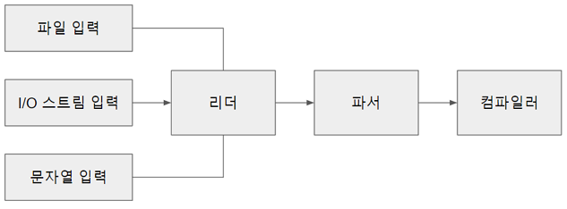
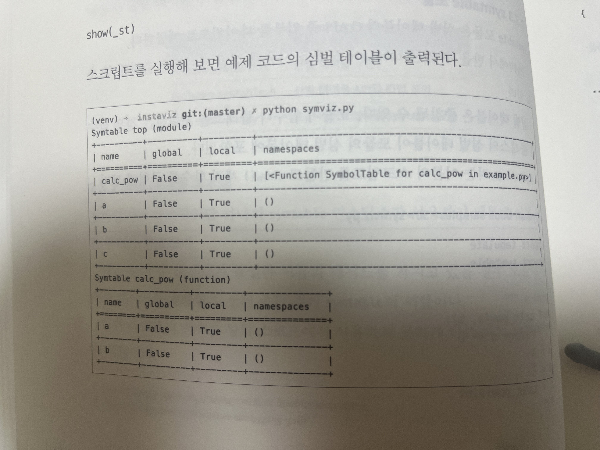

## 컴파일러

##### 파이썬 코드를 파싱하면 파이썬 코드의 연산자, 함수, 클래스, 이름 공간을 포함하는 AST가 생성된다.
##### 컴파일러의 역할은 이러한 AST를 CPU 명령으로 바꾸는 것이다.



##### 컴파일러 : AST를 순회하며 논리적 실행 순서를 나타내는 제어 흐름 그래프(control flow graph, CFG)를 생성한다.

##### 어셈블러 : CFG의 노드들을 실행 가능한 명령을 순차적으로 나열한 바이트 코드 형태로 변환한다.

##### 컴파일 과정
##### [파서] - AST -> [컴파일러] - CFG -> [어셈블러] - 바이트코드 -> 실행

##### 이번 장에서는 AST 모듈을 코드 객체로 컴파일 하는 과정에 대해서 알아 본다.

##### Python/compile.c : 컴파일러 구현
##### Include/compile.h : 컴파일러 API와 타입 정의

##### 처음 접하는 용어
##### 컴파일러 상태 : 심벌 테이블을 담는 컨테이너 타입
##### 심벌 테이블 : 변수 이름을 포함하고 추가로 하위 심벌 테이블을 포함 할 수 있다.
##### 컴파일러 타입에는 컴파일러 유닛도 포함된다.
##### 컴파일러 유닛 : 각각 이름, 변수 이름, 상수, 셀 변수들을 포함한다.
##### 컴파일러 유닛은 기본 프레임 블록을 포함한다.
##### 기본 프레임 블록은 바이트코드 명령을 포함한다. 


##### 컴파일러 상태 컨테이너와 컨테이너의 구성 요소를 그림으로 표현한 것이다.

### 7.1 컴파일러 인스턴스 생성

##### 컴파일러를 실행하기에 앞서 전역 컴파일러 상태가 생성된다.
##### 컴파일러 상태 구조체인 compiler 타입은 컴파일러 플래그나 스택, PyArena등 컴파일러를 위한 다양한 프로퍼티를 포함한다.
##### 컴파일러 상태는 심벌 테이블 등의 다른 구조체도 포함한다. 

### 7.2 퓨처 플래그와 컴파일러 플래그

##### 퓨처 플래그와 컴파일러 플래그는 컴파일러 기능을 설정한다.
##### 이플래그 들은 다음 위치에서 설정 할 수 있다.

##### 1. 환경 변수와 명령줄 플래그를 담는 구성 상태
##### 2. 모듈 소스 코드의 __future__문

#### 7.2.1 퓨처 플래그

##### 퓨처 플래그는 특정 모듈에서 문법이나 언어 기능을 활성화하기 위해 사용된다.

##### from __future__ import annotations

##### 이 퓨처 문 아래부터 결정되지 않은 타입 힌트를 사용할 수 있다.

#### 7.2.2 파이썬 3.9의 퓨처 플래그 목록

#### 7.2.3 컴파일러 플래그

##### 컴파일러 플래그는 실행 환경에 의존적이기 때문에 코드나 컴파일러의 실행 방식을 변경 할 수 있다.

***

### 7.3 심벌 테이블

##### 코드를 컴파일하기 전에 PySymtable_BuildObject() API는 심벌 테이블을 생성 한다.

#### 7.3.1 연관된 소스 파일 목록

##### Python/symtable.c : 심벌 테이블 구현
##### Include/symtable.h : 심벌 테이블 API와 타입정의
##### Lib/symtable.py : 표준 라이브러리의 symtable 모듈

#### 7.3.2 심벌 테이블 구조체

##### 심볼 테이블의 역할
##### 1. 두 클래스 가 동일한 이름의 메서드를 가지고 있을 경우 모듈에서 어떤 메서드를 호출하지 정해 주는것이 symtable의 역할
##### 2. 하위 스코프의 변수를 상위 스코프에서 사용하지 못하게 하는 것
##### 3. 위와 같이 변수 충돌 방지 및 오류를 줄이고 실행 성능을 높입니다.



#### 7.3.3 symtable 모듈

##### 모듈이 함수나 클래스를 포함 하는 경우 함수나 클래스의 심벌 테이블이 모듈의 심벌 테이블에 포함된다.

#### 7.3.4 심벌 테이블 구현

##### PySymtable_BuildObject()는 mod_ty 타입(Module, Interactive, Expression, FunctionType)에 따라 모듈 내의 문장들을 순회한다.

##### PySymtable_BuildObject()은 모듈의 각 문을 순회하며 symtale_visit_stmt()를 호출한다.

##### symtale_visit_stmt()는 Parser/Python.asdl에서 정의한 모든 문 타입에 대한 case를 가지고 있는 거대한 switch 문이다.

##### 마지막으로 symtable_enter_block()이 함수 블록을 방문해 인자와 함수 본문을 차례대로 처리한다.

```
struct symtable *
PySymtable_BuildObject(mod_ty mod, PyObject *filename, PyFutureFeatures *future)
{
    struct symtable *st = symtable_new();
    asdl_seq *seq;
    int i;
    PyThreadState *tstate;
    int recursion_limit = Py_GetRecursionLimit();
    int starting_recursion_depth;

    if (st == NULL)
        return NULL;
    if (filename == NULL) {
        PySymtable_Free(st);
        return NULL;
    }
    Py_INCREF(filename);
    st->st_filename = filename;
    st->st_future = future;

    /* Setup recursion depth check counters */
    tstate = _PyThreadState_GET();
    if (!tstate) {
        PySymtable_Free(st);
        return NULL;
    }
    /* Be careful here to prevent overflow. */
    starting_recursion_depth = (tstate->recursion_depth < INT_MAX / COMPILER_STACK_FRAME_SCALE) ?
        tstate->recursion_depth * COMPILER_STACK_FRAME_SCALE : tstate->recursion_depth;
    st->recursion_depth = starting_recursion_depth;
    st->recursion_limit = (recursion_limit < INT_MAX / COMPILER_STACK_FRAME_SCALE) ?
        recursion_limit * COMPILER_STACK_FRAME_SCALE : recursion_limit;

    /* Make the initial symbol information gathering pass */
    if (!GET_IDENTIFIER(top) ||
        !symtable_enter_block(st, top, ModuleBlock, (void *)mod, 0, 0)) {
        PySymtable_Free(st);
        return NULL;
    }

    st->st_top = st->st_cur;
    switch (mod->kind) {
    case Module_kind:
        seq = mod->v.Module.body;
        for (i = 0; i < asdl_seq_LEN(seq); i++)
            if (!symtable_visit_stmt(st,
                        (stmt_ty)asdl_seq_GET(seq, i)))
                goto error;
        break;
    case Expression_kind:
        if (!symtable_visit_expr(st, mod->v.Expression.body))
            goto error;
        break;
    case Interactive_kind:
        seq = mod->v.Interactive.body;
        for (i = 0; i < asdl_seq_LEN(seq); i++)
            if (!symtable_visit_stmt(st,
                        (stmt_ty)asdl_seq_GET(seq, i)))
                goto error;
        break;
    case FunctionType_kind:
        PyErr_SetString(PyExc_RuntimeError,
                        "this compiler does not handle FunctionTypes");
        goto error;
    }
    if (!symtable_exit_block(st)) {
        PySymtable_Free(st);
        return NULL;
    }
    /* Check that the recursion depth counting balanced correctly */
    if (st->recursion_depth != starting_recursion_depth) {
        PyErr_Format(PyExc_SystemError,
            "symtable analysis recursion depth mismatch (before=%d, after=%d)",
            starting_recursion_depth, st->recursion_depth);
        PySymtable_Free(st);
        return NULL;
    }
    /* Make the second symbol analysis pass */
    if (symtable_analyze(st))
        return st;
    PySymtable_Free(st);
    return NULL;
 error:
    (void) symtable_exit_block(st);
    PySymtable_Free(st);
    return NULL;
}
```

***

### 7.4 핵심 컴파일 과정

##### PyAST_CompileObject()에 컴파일러 상태와 symtable, AST로 파싱된 모듈이 준비되면 컴파일이 시작된다.

##### 코어 컴파일러는 두 가지 작업을 수행한다.
##### 1. 컴파일러 상태와 심벌 테이블, AST를 제어 흐름 그래프로 변환한다.
##### 2. 논리 오류나 코드 오류를 탐지해 실행 단계를 런타임 예외로부터 보호 한다.

#### 7.4.1 파이썬에서 컴파일러 사용하기

##### 내장 함수인 compile()로 컴파일러를 직접 호출할 수 있다.
```
>>> co = compile("b+1", "test.py", mode="eval")
>>> co
<code object <module> at 0x100f502b0, file "test.py", line 1>
>>> co.co_code
b'e\x00d\x00\x17\x00S\x00'
>>> co = compile("b+1", "test.py", mode="exec")
>>> co
<code object <module> at 0x100f50380, file "test.py", line 1>
>>> co.co_code
b'e\x00d\x00\x17\x00\x01\x00d\x01S\x00'
```

##### 컴파일된 코드는 co_code 프로퍼티에 담긴다.

```
>>> import dis
>>> dis.dis(co.co_code)
          0 LOAD_NAME                0 (0)
          2 LOAD_CONST               0 (0)
          4 BINARY_ADD
          6 POP_TOP
          8 LOAD_CONST               1 (1)
         10 RETURN_VALUE
```

##### dis는 역어셈블러 모듈로 컴파일된 코드를 역어셈블한 후 REPL에 출력한다.
##### LOAD_NAME, LOAD_CONST... 등은 바이트 코드 명령어다 (워드코드)

#### 7.4.2 컴파일러 C API

##### AST 모듈 컴파일의 진입점인 compiler_mod()는 모듈 타입에 따라 다른 컴파일러 함수를 사용한다.

##### mod가 Module일 경우 모듈은 컴파일러 유닛으로 컴파일 되어 c_stack 프로퍼티에 저장된다.

##### 이후 컴파일러 유닛 스택에서 PyCodeObject를 생성하기 위해 assemble()를 실행한다.

```
static PyCodeObject *
compiler_mod(struct compiler *c, mod_ty mod)
{
    PyCodeObject *co;
    int addNone = 1;
    static PyObject *module;
    if (!module) {
        module = PyUnicode_InternFromString("<module>");
        if (!module)
            return NULL;
    }
    /* Use 0 for firstlineno initially, will fixup in assemble(). */
    if (!compiler_enter_scope(c, module, COMPILER_SCOPE_MODULE, mod, 0))
        return NULL;
    switch (mod->kind) {
    case Module_kind:
        if (!compiler_body(c, mod->v.Module.body)) {
            compiler_exit_scope(c);
            return 0;
        }
        break;
    case Interactive_kind:
        if (find_ann(mod->v.Interactive.body)) {
            ADDOP(c, SETUP_ANNOTATIONS);
        }
        c->c_interactive = 1;
        VISIT_SEQ_IN_SCOPE(c, stmt,
                                mod->v.Interactive.body);
        break;
    case Expression_kind:
        VISIT_IN_SCOPE(c, expr, mod->v.Expression.body);
        addNone = 0;
        break;
    default:
        PyErr_Format(PyExc_SystemError,
                     "module kind %d should not be possible",
                     mod->kind);
        return 0;
    }
    co = assemble(c, addNone);
    compiler_exit_scope(c);
    return co;
}

```

##### compiler_body()는 모듈의 각 문을 순회하며 방문한다.

```
static int
compiler_body(struct compiler *c, asdl_seq *stmts)
{
    int i = 0;
    stmt_ty st;
    PyObject *docstring;

    /* Set current line number to the line number of first statement.
       This way line number for SETUP_ANNOTATIONS will always
       coincide with the line number of first "real" statement in module.
       If body is empty, then lineno will be set later in assemble. */
    if (c->u->u_scope_type == COMPILER_SCOPE_MODULE && asdl_seq_LEN(stmts)) {
        st = (stmt_ty)asdl_seq_GET(stmts, 0);
        SET_LOC(c, st);
    }
    /* Every annotated class and module should have __annotations__. */
    if (find_ann(stmts)) {
        ADDOP(c, SETUP_ANNOTATIONS);
    }
    if (!asdl_seq_LEN(stmts))
        return 1;
    /* if not -OO mode, set docstring */
    if (c->c_optimize < 2) {
        docstring = _PyAST_GetDocString(stmts);
        if (docstring) {
            i = 1;
            st = (stmt_ty)asdl_seq_GET(stmts, 0);
            assert(st->kind == Expr_kind);
            VISIT(c, expr, st->v.Expr.value);
            if (!compiler_nameop(c, __doc__, Store))
                return 0;
        }
    }
    for (; i < asdl_seq_LEN(stmts); i++)
        VISIT(c, stmt, (stmt_ty)asdl_seq_GET(stmts, i));
    return 1;
}

```

##### AST 노드 타입을 확인하는 asdl_seq_GET() 호출을 통해 이문의 타입이 결정 된다.

##### 모든 문을 포괄하는 stmt 타입의 경우 컴파일러는 compiler_visit_stmt()를 호출해 Parser/Python.asdl에 정의된 하위 문 타입들로 전환한다.


##### for 문일 경우 compiler_visit_stmt()는 compiler_for()를 호출한다.
##### 모든 문과 표현식 타입에는 해당 타입에 대한 compiler_*()함수가 존재한다.
##### 간단한 타입들은 인라인으로 바이트코드 명령을 생성하지만 더복잡한 문 타입들은 다른 함수를 호출하기도 한다.


#### 7.4.3 명령

##### 많은 문장이 다른 하위 문장을 포함한다. for문은 본문 외에도 대입문이나 이터레이터에 복잡한 표현식을 사용할 수있다.
##### 컴파일러는 일련의 명령을 담고 있는 블록을 컴파일러 상태로 내보낸다.
##### 명령 구조체는 명령 코드와 인자, 문장이 위치한 줄 번호를 포함한다.
##### 점프 명령일 경우 점프할 블록에 대한 포인터도 포함한다.


##### 점프명령은 한 명령에서 다른 명령으로의 점프를 실행한다.

#### 7.4.4 기본 프레임 블록

##### 기본 프레임 블록의 필드들이다.


#### 7.4.5 명령어와 인자

##### 각 명령어는 각기 다른 인자를 요구한다.
##### 예를 들어 ADDOP_JREL과 ADDOP_JABS는 각각 상대 점프명령 추가와 절대 점프명령 추가를 뜻한다.

***

### 7.5 어셈블리

##### 컴파일 단계가 끝나면 프레임 블록 리스트가 완성된다.
##### 각 프레임 블록은 일련의 명령 리스트와 다음 블록을 가리키는 포인터를 가진다.
##### 어셈블러는 기본 프레임 블록들에 대해 깊이 우선 탐색을 실행하고 명령들을 단일한 바이트코드 시퀀스로 병합한다.

#### 7.5.1 어셈블러 구조체 

##### assembler의 필드들


#### 7.5.2 어셈블러의 깊이 우선 탐색 알고리즘

##### 어셈블러는 기본 프레임 블록 그래프를 DFS로 탐색한다.
##### 트리 구조인 CST와 AST와는 달리 컴파일러 상태는 노드가 명령을 담는 기본 프레임 블록인 그래프다.

##### 기본 프레임 블록은 두 그래프에 연결된다.
##### 첫 번째 그래프는 각 블록의 b_list 프로퍼티를 기준으로 생성되며, 블록이 생성된 순서와 반대로 정렬된다.


##### b_list에서 생성된 그래프를 통해 컴파일러 유닛의 모든 블록을 순차적으로 방문할 수 있다.

##### 두 번째 그래프는 각 블록의 b_next 프로퍼티를 기준으로 생성된다.
##### 이 그래프는 제어 흐름을 나타낸다.
##### 그래프의 정점들은 compiler_use_next_block(c, next)의 호출로 생성된다.
##### next는 현재 블록(c -> u -> u_curblock)과 이어질 정점이 될 다음 블록이다.


#### 7.5.3 어셈블러 C API

##### assemble()의 역할

##### - 메모리 할당을 위해 블록 개수를 계산한다.
##### - 마지막 블록이 None을 반환하는지 확인한다.
##### - 모든 상대 주소 점프 명령의 오프셋을 계산한다.
##### - dfs() 호출로 블록에 대한 DFS를 실행한다.
##### - 컴파일러로 모든 명령을 전달한다.
##### - 컴파일러 상태를 인자로 해서 makecode()를 호출해 PyCodeObject를 생성한다.

```
static PyCodeObject *
assemble(struct compiler *c, int addNone)
{
    basicblock *b, *entryblock;
    struct assembler a;
    int i, j, nblocks;
    PyCodeObject *co = NULL;

    /* Make sure every block that falls off the end returns None.
       XXX NEXT_BLOCK() isn't quite right, because if the last
       block ends with a jump or return b_next shouldn't set.
     */
    if (!c->u->u_curblock->b_return) {
        NEXT_BLOCK(c);
        if (addNone)
            ADDOP_LOAD_CONST(c, Py_None);
        ADDOP(c, RETURN_VALUE);
    }

    nblocks = 0;
    entryblock = NULL;
    for (b = c->u->u_blocks; b != NULL; b = b->b_list) {
        nblocks++;
        entryblock = b;
    }

    /* Set firstlineno if it wasn't explicitly set. */
    if (!c->u->u_firstlineno) {
        if (entryblock && entryblock->b_instr && entryblock->b_instr->i_lineno)
            c->u->u_firstlineno = entryblock->b_instr->i_lineno;
        else
            c->u->u_firstlineno = 1;
    }
    if (!assemble_init(&a, nblocks, c->u->u_firstlineno))
        goto error;
    dfs(c, entryblock, &a, nblocks);

    /* Can't modify the bytecode after computing jump offsets. */
    assemble_jump_offsets(&a, c);

    /* Emit code in reverse postorder from dfs. */
    for (i = a.a_nblocks - 1; i >= 0; i--) {
        b = a.a_postorder[i];
        for (j = 0; j < b->b_iused; j++)
            if (!assemble_emit(&a, &b->b_instr[j]))
                goto error;
    }

    if (_PyBytes_Resize(&a.a_lnotab, a.a_lnotab_off) < 0)
        goto error;
    if (_PyBytes_Resize(&a.a_bytecode, a.a_offset * sizeof(_Py_CODEUNIT)) < 0)
        goto error;

    co = makecode(c, &a);
 error:
    assemble_free(&a);
    return co;
}
```

#### 7.5.4 깊이 우선 탐색

##### Python/compile.c의 dfs()는 각 블록의 b_next 포인터를 따라가며 블록의 b_seen 프로퍼티를 참으로 설정하고, 어셈블러의 a_postoder 리스트에 블록을 역순으로 추가하면서 dfs를 실행한다.

##### 모든 블록을 탐색했으면 dfs()는 a_postorder 리스트를 다시 순회하고ㅡ 점프 명령을 찾을 때마다 dfs()를 재귀적으로 호출한다.

```
static void
dfs(struct compiler *c, basicblock *b, struct assembler *a, int end)
{
    int i, j;

    /* Get rid of recursion for normal control flow.
       Since the number of blocks is limited, unused space in a_postorder
       (from a_nblocks to end) can be used as a stack for still not ordered
       blocks. */
    for (j = end; b && !b->b_seen; b = b->b_next) {
        b->b_seen = 1;
        assert(a->a_nblocks < j);
        a->a_postorder[--j] = b;
    }
    while (j < end) {
        b = a->a_postorder[j++];
        for (i = 0; i < b->b_iused; i++) {
            struct instr *instr = &b->b_instr[i];
            if (instr->i_jrel || instr->i_jabs)
                dfs(c, instr->i_target, a, j);
        }
        assert(a->a_nblocks < j);
        a->a_postorder[a->a_nblocks++] = b;
    }
}
```

##### 어셈블러가 DFS를 통해 그래프를 제어 흐름 그래프로 변환해야 코드 객체를 생성할 수 있다.

***

### 7.6 코드 객체 생성

##### makecode()는 컴파일러 상태와 어셈블러의 프로퍼티들을 확인하고 PyCode_New()를 호출해 PyCodeObject에 컴파일러 상태와 어셈블러 프로퍼티를 추가한다. 

##### 변수 이름과 상수들은 코드 객체의 프로퍼티로 추가된다.

```
static PyCodeObject *
makecode(struct compiler *c, struct assembler *a)
{
    PyObject *tmp;
    PyCodeObject *co = NULL;
    PyObject *consts = NULL;
    PyObject *names = NULL;
    PyObject *varnames = NULL;
    PyObject *name = NULL;
    PyObject *freevars = NULL;
    PyObject *cellvars = NULL;
    PyObject *bytecode = NULL;
    Py_ssize_t nlocals;
    int nlocals_int;
    int flags;
    int posorkeywordargcount, posonlyargcount, kwonlyargcount, maxdepth;

    consts = consts_dict_keys_inorder(c->u->u_consts);
    names = dict_keys_inorder(c->u->u_names, 0);
    varnames = dict_keys_inorder(c->u->u_varnames, 0);
    if (!consts || !names || !varnames)
        goto error;

    cellvars = dict_keys_inorder(c->u->u_cellvars, 0);
    if (!cellvars)
        goto error;
    freevars = dict_keys_inorder(c->u->u_freevars, PyTuple_GET_SIZE(cellvars));
    if (!freevars)
        goto error;

    if (!merge_const_tuple(c, &names) ||
            !merge_const_tuple(c, &varnames) ||
            !merge_const_tuple(c, &cellvars) ||
            !merge_const_tuple(c, &freevars))
    {
        goto error;
    }

    nlocals = PyDict_GET_SIZE(c->u->u_varnames);
    assert(nlocals < INT_MAX);
    nlocals_int = Py_SAFE_DOWNCAST(nlocals, Py_ssize_t, int);

    flags = compute_code_flags(c);
    if (flags < 0)
        goto error;

    bytecode = PyCode_Optimize(a->a_bytecode, consts, names, a->a_lnotab);
    if (!bytecode)
        goto error;

    tmp = PyList_AsTuple(consts); /* PyCode_New requires a tuple */
    if (!tmp)
        goto error;
    Py_DECREF(consts);
    consts = tmp;
    if (!merge_const_tuple(c, &consts)) {
        goto error;
    }

    posonlyargcount = Py_SAFE_DOWNCAST(c->u->u_posonlyargcount, Py_ssize_t, int);
    posorkeywordargcount = Py_SAFE_DOWNCAST(c->u->u_argcount, Py_ssize_t, int);
    kwonlyargcount = Py_SAFE_DOWNCAST(c->u->u_kwonlyargcount, Py_ssize_t, int);
    maxdepth = stackdepth(c);
    if (maxdepth < 0) {
        goto error;
    }
    co = PyCode_NewWithPosOnlyArgs(posonlyargcount+posorkeywordargcount,
                                   posonlyargcount, kwonlyargcount, nlocals_int,
                                   maxdepth, flags, bytecode, consts, names,
                                   varnames, freevars, cellvars, c->c_filename,
                                   c->u->u_name, c->u->u_firstlineno, a->a_lnotab);
 error:
    Py_XDECREF(consts);
    Py_XDECREF(names);
    Py_XDECREF(varnames);
    Py_XDECREF(name);
    Py_XDECREF(freevars);
    Py_XDECREF(cellvars);
    Py_XDECREF(bytecode);
    return co;
}
```

##### PyCode_NewWithPosOnlyArgs()로 전송되기 전에 PyCode_Optimize()로 전송되는 바이트코드를 확인할 수 있다. 바이트 코드 최적화 과정의 일부다.

##### 핍홀 옵티마이저는 바이트코드 명령을 확인하고 특정 시나리오에 해당될 경우 해당 명령을 다른 명령으로 교체한다. 예를 들어 return 문 뒤의 도달할 수 없는 명령을 제거한다.

***