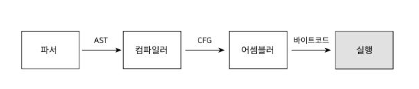
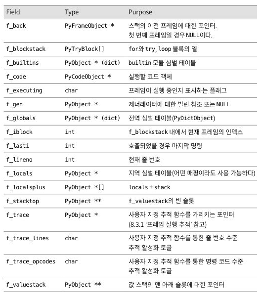
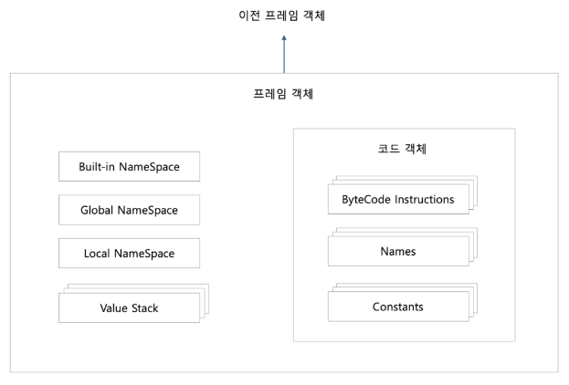
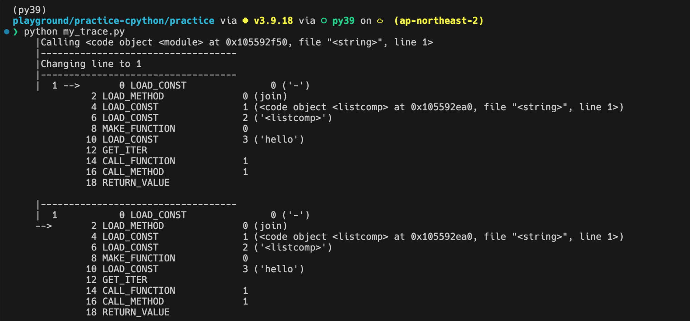
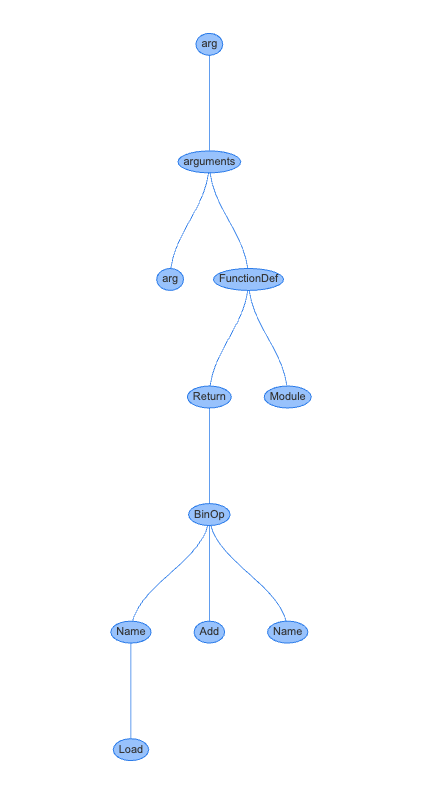
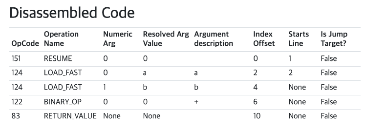
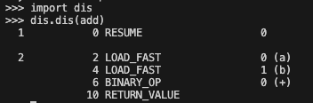
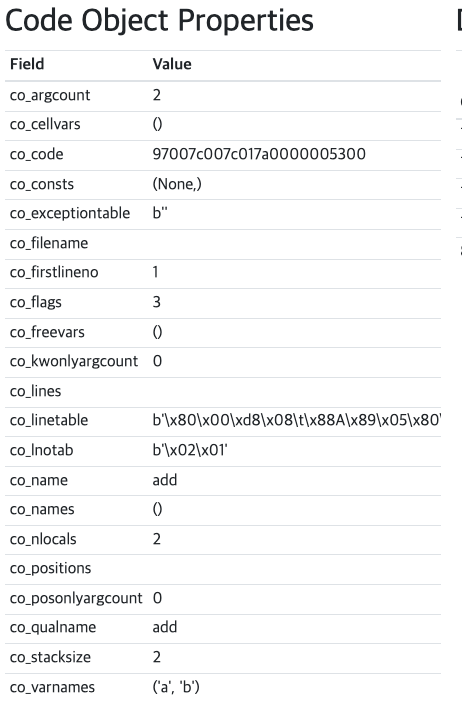
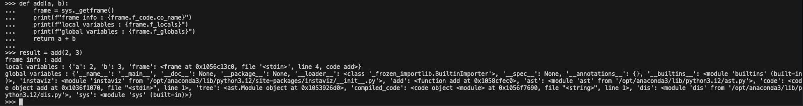

## 평가 루프

##### 컴파일까지 하고 나면 코드 객체가 생성된다
##### 이러한 코드 객체는 입력이 있어야 실행 할 수 있다.
##### 컴파일된 코드 객체에서 바이트코드 연산들은 값 스택에서 변수를 생성하고 변경, 사용한다.



##### - 평가 루프는 코드 객체를 입력받아 이련의 프레임 객체를 변환한다.
##### - 인터프리터는 최소 한개의 스레드를 가진다.
##### - 각 스레드는 스레드 상태를 가진다.
##### - 프레임 객체는 프레임 스택에서 실행된다.
##### - 값 스택에서 변수를 참조할 수 있다.

### 8.1 스레드 상태 생성하기

##### 프레임을 실행하려면 스레드에 연결해야 한다.

#### 8.1.1 스레드 상태

##### PyThreadState 스레드 상태 타입은 서른개가 넘는 프로퍼티를 가지고 있다.
##### 고유 식별자
##### 다른 스레드 상태와 연결된 연결 리스트
##### 현재 실행 중인 프레임
##### 현재 재귀 깊이
##### 선택적 추적 함수들
##### 현재 처리 중인 예외
##### 현재 처리 중인 비동기 예외
##### 여러 예외가 발생할 때의 예외 스택
##### GIL(global interpreter lock) 카운터
##### 비동기 제너레이터 카운터

#### 8.1.2 연관된 소스 파일 목록

##### Python/thread.c : 스레드 API 구현
##### Include/threadstate.h : 스레드 상태 API와 타입 정의
##### Include/pystate.h : 인터프리터 상태 API와 타입 정의
##### Include/pythread.h : 스레딩 API
##### Include/cpython/pystate.h : 스레드와 인터프리터 상태 API

***

### 8.2 프레임 객체 생성하기

##### 컴파일된 코드 객체는 프레임 객체에 삽입된다.
##### 프레임 객체는 코드 객체의 명령을 실행하는데 필요한 런타임 데이터를 포함한다. (전역, 지역변수, 내장 모듈)

#### 8.2.1 프레임 객체



#### 8.2.2 연관된 소스 파일 목록

##### Objects/frameobject.c : 프레임 객체 구현과 파이썬 API
##### Include/frameobject.h : 프레임 객체 API와 타입 정의

#### 8.2.3 프레임 객체 초기화 API

```
/* Python/ceval.c */

_PyEval_EvalCode(PyThreadState *tstate,
           PyObject *_co, PyObject *globals, PyObject *locals,
           PyObject *const *args, Py_ssize_t argcount,
           PyObject *const *kwnames, PyObject *const *kwargs,
           Py_ssize_t kwcount, int kwstep,
           PyObject *const *defs, Py_ssize_t defcount,
           PyObject *kwdefs, PyObject *closure,
           PyObject *name, PyObject *qualname)

```

##### tstate : 코드를 평가할 스레드의 상태를 나타냄
##### _co : 프레임 객체에 삽입할 코드 객체
##### globals : 전역 변수, 변수명을 키로 사용
##### lcoals : 지역 변수, 변수명을 키로 사용

##### 주요 흐름
##### 1. 스레드 상태가 유효한지 확인한다.
##### 2. 프레임 객체를 선언하고 그 반환값을 초기화하는 등 초기화 작업을 진행한다.
##### 3. 프레임 객체를 생성한다.
##### 4. 인자와 변수를 처리한다.
##### 5. 제너레이터 객체와 코루틴 객체를 처리한다.
##### 6. 프레임을 실행하고 결과를 저장한다.
##### 7. 프레임 객체의 참조 수를 확인하고 관련 객체들을 해제한다.
##### 8. 결과를 반환한다.



##### Built-in NameSpace : Python 내장 함수와 객체들이 저장된 공간
##### Global NameSpace : 전역 변수와 함수가 저장된 공간입니다.
##### Local NameSpace : 함수나 코드 블록 내에서 정의된 지역 변수들이 저장된 공간 입니다. 함수 호출시 마다 새로운 지역 네임스페이스가 생성됩니다.
##### Value Stack : 연산을 수행하기 위해 임시로 값을 저장하는 스택입니다. 바이트코드 명령어를 처리할때 사용됩니다. 예를 들어, 두값을 더할 때 두 값이 스택에 push되고, 연산 후 결과가 스택에 다시 push됩니다.

##### ByteCode Insturctions : python 소스 코드가 컴파일되어 생성된 명령어들 입니다. 바이트 코드는 python 인터프리터가 실행할 수 있는 저 수준 명령어 입니다. 예 ) LOAD_CONST, LOAD_NAME ...
##### Names : 코드에서 사용되는 변수, 함수 이름등의 리스트입니다. 실행 중에 이 이름들이 해석됩니다.
##### Constatns : 코드에서 사용되는 리터럴 상수 값들이 저장됩니다.

```
def sample():
    x = 5
    print(x)

    return 4.29
```

##### 여기서 x, print는 Names에 저장됩니다. 4.29는 Constants에 저장됩니다.

##### 이전 프레임 객체 : 현재 실행 중인 프레임 객체를 호출한 프레임을 나타냅니다.
##### - 함수 호출이나 코드 블록 실행 시, 새 프레임 객체가 생성되고 이전 프레임 객체와 연결됩니다.
##### - 프레임 간의 연결을 통해 스택 프레임 구조가 만들어집니다.

***

### 8.3 프레임 실행

##### _PyEval_EvalFrameDefault()는 기본 프레임 평가함수이며, 이 함수가 모든것을 통합하는 역할을 수행합니다.
##### 간단히 말해, 파이썬 프로그램이 실행될 때, 각각의 코드 객체는 실행을 위해 '프레임'이라는 단위로 관리되고 _PyEval_EvalFrameDefault()는 이러한 프레임들을 하나씩 받아서 순차적으로 명령을 실행하게 됩니다.

#### 8.3.1 프레임 실행 추적

```
import io
import sys
import dis
import traceback

def my_trace(frame, event, args):
	frame.f_trace_opcodes = True
	stack = traceback.extract_stack(frame)
	pad = "  "*len(stack) + "|"
	if event == 'opcode':
		with io.StringIO() as out:
			dis.disco(frame.f_code, frame.f_lasti, file=out)
			lines = out.getvalue().split('\\n')
			[print(f"{pad}{l}") for l in lines]
	elif event == 'call':
		print(f"{pad}Calling {frame.f_code}")
	elif event == 'return':
		print(f"{pad}Returning {args}")
	elif event == 'line':
		print(f"{pad}Changing line to {frame.f_lineno}")
	else:
		print(f"{pad}{frame} ({event} - {args})")
	print(f"{pad}-----------------------------------")
	return my_trace

sys.settrace(my_trace)

# 데모용 코드 실행
eval('"-".join([letter for letter in "hello"])')

```



##### 0, 2, 4, 6, 8... 바이트코드의 오프셋 : 명령어의 위치 (주소)

##### 실행의 흐름
##### 1. 소스코드 작성
```
def add(a, b):
    return a + b
```

##### 2. 파싱
python 인터프리터는 작성된 코드를 파싱하여 AST (abstract syntax tree)를 생성합니다.



##### 3. 바이트 코드로 컴파일





##### 4. 코드 객체



##### 5. 프레임 객체



##### 6. 바이트코드 명령 실행
##### 바이트 코드를 하나씩 읽으며 실행합니다.

***

### 8.4 값 스택

#### 8.4.1 바이트코드 명령 예제: BINARY_OR

#### 8.4.2 값 스택 시뮬레이션

#### 8.4.3 스택 효과

***

### 8.5 예제: 리스트에 요소를 추가하기